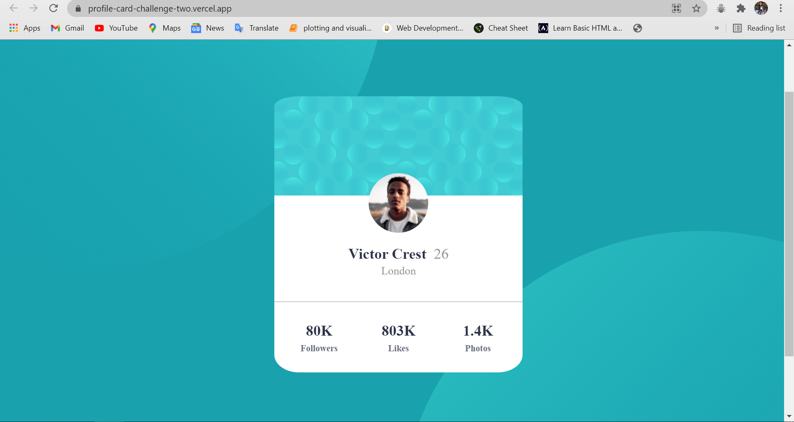

# Frontend Mentor - Profile card component

This is a solution to the [Profit card challenge on Frontend Mentor](https://www.frontendmentor.io/challenges/profile-card-component-cfArpWshJ/hub/profilecard-challenge-jIxr86H0c). Frontend Mentor challenges help you improve your coding skills by building realistic projects. 

## Table of contents

- [Overview](#overview)
- [The challenge](#the-challenge)
- [Screenshot](#screenshot)
- [Links](#links)
- [My process](#my-process)
- [Built with](#built-with)
- [What I learned](#what-i-learned)
- [Continued development](#continued-development)
- [Useful resources](#useful-resources)
- [Author](#author)

## Overview
Completed challenge using Bootstrap 

### The challenge

Users should be able to:

- View the optimal layout depending on their device's screen size

### Screenshot



### Links

- Solution URL: [https://github.com/mansi05041/profile-card-challenge.github.io]
- Live Site URL: [https://profile-card-challenge-two.vercel.app/]

## My process

I use bootstrap for responsive part. 

### Built with

- Semantic HTML5 markup
- CSS custom properties
- Mobile-first workflow
- Bootstrap

### What I learned

```css
body{
  font-size:18px;
  font-family: "kumbh sans";
  background: bottom 40vh right 50vw url('images/bg-pattern-top.svg') no-repeat,
              top 50vh left 50vw url('images/bg-pattern-bottom.svg') no-repeat,
              hsl(185, 75%, 39%);
  background-attachment: fixed;
  background-color:  hsl(185, 75%, 39%);

}
```
Setting background image is challenging.


### Continued development

Still need improvement with allignment & responsive part

### Useful resources

- [Bootstrap](https://getbootstrap.com/) - This helped me in columns breakpoint & grid.

## Author

- Frontend Mentor - [@mansi05041](https://www.frontendmentor.io/profile/mansi05041)
- Linkedin - [mansi joshi](https://www.linkedin.com/in/mansi-joshi-663aa81a0/)


